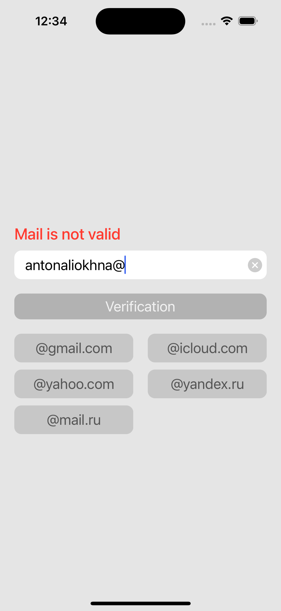

# Verification App
---

### Цели:

Данное приложение созданно для проверки структуры и корректности введенного пользователем email-адресса. Приложение помогает выбрать доменный адресс исходя из ввода пользователя в режиме реального времени после знакак "@". После успешной валидации, пользователь может проверить существование данного адресса в сети интерет посредством использования сторонних сервисов API. В случаи ошибки в доменном адрессе почты, приложение предложит заменить его на корретный. 

---

## Стек используемых технологий:

- UIKit (code).
- Архитектура приложения - MVVM.
- Продемонстированна работа с многопоточностью при помощи GCD.
- В качестве сетевых запросов был использованн механизм URLSession.
- Написано небольшое количество простых Unit тестов.
- Использованны принципы программирования SOLID

#### Screenshot

