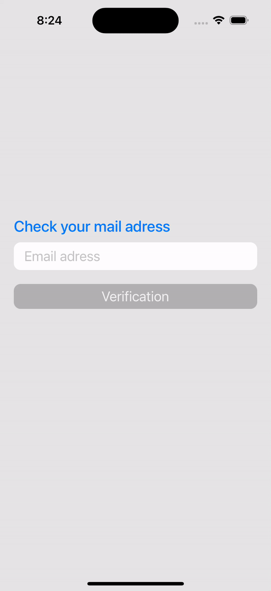

# Verification App
---

### Targets:

This application is designed to check the structure and correctness of the email address entered by the user. The application helps to select a domain address based on the user's real-time input after the "@" sign. After successful validation, the user can check the existence of the address via third party API services. In case of an error in the email domain address, the application will offer to replace it with the correct one.

---

## Stack of technologies:

- UIKit (code).
- The architecture of the application is MVVM.
- Demonstrated multi-threading using GCD.
- URLSession was used as the network request mechanism.
- A small number of simple Unit tests were written.
- Used SOLID programming principles.

#### Screenshot and gif

